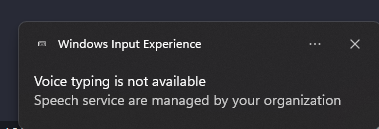
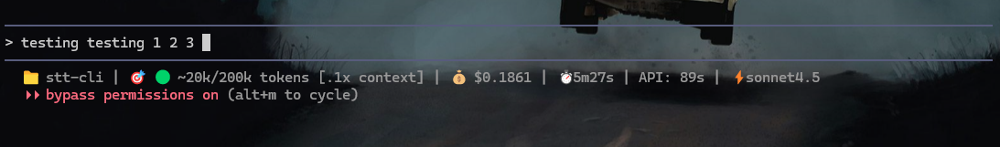
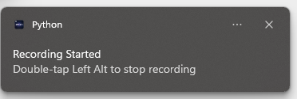

<!--  header -->
<div align="center">
  
</div>


# STT CLI

This project is a simple command-line interface (CLI) tool for Windows that provides speech-to-text functionality. It runs in the background, listens for a global hotkey, and transcribes your speech into the active command-line window.

## 🎯 Purpose and Motivation

I created this tool specifically for Windows users working on corporate laptops where Win+H is disabled by IT policies. After discovering that the built-in Windows voice typing was blocked on my work machine, I needed a solution that would:

- **Work without admin rights** - No installation or system modifications required
- **Run portably** - Just a single .exe file that runs from anywhere
- **Bypass corporate restrictions** - Doesn't touch system settings or require permissions
- **Support CLI workflows** - Specifically designed for command-line interfaces like Windows Terminal, PowerShell, and AI coding tools

I primarily use this with **Claude Code** and **Gemini CLI**, where voice input dramatically speeds up my workflow. Macs already have built-in speech-to-text features, and there are apps like SuperWhisper, Voicy, and Voice Mode that work nicely with these tools. But when I looked for a Windows alternative that worked around corporate restrictions, nothing existed. This tool fills that gap for Windows users who need voice control in the CLI but are blocked by enterprise policies.

## The Problem: Win+H Disabled on Corporate Laptops

Many corporate and enterprise Windows laptops have the built-in voice typing feature (Win+H) disabled by IT policies and group restrictions. When you try to use it, you'll see this frustrating message:

<div align="center">
  
</div>

**"Voice typing is not available - Speech service are managed by your organization"**

This leaves users without any voice-to-text capability for their command-line workflows, especially problematic when:
- You can't install software requiring admin rights
- Group policies prevent modifying system settings
- You need hands-free typing for accessibility or efficiency
- You're working with AI coding assistants like Claude Code or Gemini CLI

## The Solution: STT-CLI Running in the Background

STT-CLI solves this by running quietly in the background without requiring admin rights or system modifications. Simply double-tap Left Alt to start speaking, and your words appear directly in your terminal:

<div align="center">
  
  <p><i>Using STT-CLI with Claude Code (cc) - speaking "testing testing 1 2 3" types directly into the terminal</i></p>
</div>

The application runs as a system tray icon, works with any CLI window, and bypasses corporate restrictions since it's just a portable executable that doesn't require installation.

## Features

- **Global Hotkey:** Press the **Left Alt** key twice in quick succession to start or stop recording.
- **Background Operation:** The application runs in the background without a visible window.
- **System Tray Icon:** A system tray icon indicates when the application is running and when it is actively listening.
- **CLI-Focused:** The transcribed text is typed directly into the active command-line window (e.g. Windows Terminal, PowerShell, Claude Code).

## Requirements

- **Operating System:** Windows 10/11
- **Python:** Python 3.x (if running from source)
- **No Admin Rights Required** - Works perfectly on corporate laptops with restricted permissions. The application doesn't install anything, doesn't modify system settings, and runs entirely in user space. Just download and run - no installation, no admin prompt, no group policy conflicts.

## Installation

### 🚀 Method 1: Windows Package Manager (Winget) - RECOMMENDED

The easiest way to install STT-CLI is through Windows Package Manager:

```bash
winget install Mantej-Singh.STT-CLI
```

**Advantages:**
- ✅ One-command installation
- ✅ Automatic updates via `winget upgrade --all`
- ✅ Trusted Microsoft repository
- ✅ Perfect for corporate IT deployment
- ✅ No manual download required

**Check for updates:**
```bash
winget upgrade Mantej-Singh.STT-CLI
```

**Uninstall:**
```bash
winget uninstall Mantej-Singh.STT-CLI
```

### Method 2: Direct Download

Alternatively, download the pre-compiled executable (`.exe`) from the [GitHub Releases](https://github.com/Mantej-Singh/stt-cli/releases/latest). Simply download the file and run it.

#### System Tray Icon


### Running from Source

If you prefer to run the application from the source code, you will need to have Python 3.x installed.

1.  **Clone the repository:**
    ```bash
    git clone https://github.com/Mantej-Singh/stt-cli.git
    cd stt-cli
    ```

2.  **Install the dependencies:**
    ```bash
    pip install -r requirements.txt
    ```

3.  **Run the application:**
    ```bash
    python main.pyw
    ```

## Usage

1.  Run the application (either the `.exe` or `main.pyw`).
2.  A system tray icon will appear to indicate that the application is running.
3.  Open your preferred command-line interface (e.g., Windows Terminal).
4.  Press the **Left Alt** key twice to start recording. The tray icon will change to indicate that it is listening.
5.  Speak into your microphone. The transcribed text will be typed into the CLI window.
6.  Press the **Left Alt** key twice again to stop recording.
7.  To quit the application, right-click on the system tray icon and select "Quit".

### Command-Line Options

**Note**: The executable is built as a GUI application (no console window) for clean system tray operation. Command-line flags work when running from Python source, but not in the compiled `.exe`. This is by design for Windows GUI apps.

**From Python source:**
```bash
python main.pyw --version  # Show version information
python main.pyw --help     # Show usage help
```

To check the version of the installed executable, see the GitHub release notes or the Windows Apps & Features list after Winget installation.

### Logs and Troubleshooting

If you encounter issues, check the log file located at:
```
%TEMP%\stt-cli\app.log
```

On Windows, this typically resolves to:
```
C:\Users\YourUsername\AppData\Local\Temp\stt-cli\app.log
```

The log file contains detailed information about:
- Application startup and shutdown
- Recording start/stop events
- Microphone and speech recognition errors
- CLI window detection

## Building from Source

If you want to build the executable yourself, you can use `PyInstaller`:

```bash
# First, make sure all dependencies are installed
pip install -r requirements.txt

# Then build the executable
python -m PyInstaller --onefile --name "speech-to-text-cli" --icon "stt-cli2.ico" --noconsole --add-data "stt-cli2.ico;." --add-data "stt-cli2.png;." --clean main.pyw
```

**Note**: The `--clean` flag ensures a fresh build. The resulting executable will be in the `dist` folder (approximately 77MB).

## 📝 Future Development

This is an initial release. Future updates will include:

-   Configurable hotkeys.
-   More visual indicators for recording status.

## Speech-to-Text Library

This project uses the `SpeechRecognition` library, which in turn uses the Google Web Speech API for transcription.

---

## 🎉 Changelog

### v1.3.1 (October 30, 2025) - Winget Readiness

**Enhancements for Package Manager Distribution:**
- ✅ Added `--version` flag to display version information
- ✅ Added `--help` flag to show usage instructions
- ✅ Added programmatic `__version__` variable for better version management
- 📖 Documented log file location in README (`%TEMP%\stt-cli\app.log`)
- 🎯 Prepared for Windows Package Manager (Winget) submission

**Why This Matters:**
This release makes STT-CLI ready for distribution via Winget (Windows Package Manager). Users will soon be able to install with a simple `winget install Mantej-Singh.STT-CLI` command!

---

### v1.3 (October 29, 2025) - Balloon Notifications

**New Feature: Visual Feedback**

<div align="center">
  
  <p><i>Windows balloon notification when recording starts</i></p>
</div>

<div align="center">
  
  <p><i>Windows balloon notification when recording stops</i></p>
</div>

STT-CLI now shows Windows balloon notifications when you start or stop recording! You no longer need to watch the system tray icon - you'll get clear visual confirmation that your hotkey press was detected.

**What's New:**
- 🔔 **Balloon notifications** appear when recording starts/stops
- ✅ **Start message** reminds you how to stop recording ("Double-tap Left Alt to stop recording")
- ✅ **Stop message** confirms recording has ended
- 🎨 Professional Windows notification system integration
- ⚙️ Configurable - can be disabled in code if needed

**Bug Fixes:**
- Fixed multi-toggle issue where rapid Alt key presses would cause recording to flash on/off
- Added 800ms cooldown period after toggle to prevent accidental multi-toggles
- Added exception handling to keyboard callbacks to prevent listener crashes
- Recording now reliably stops when you want it to!

**Under the Hood:**
- Improved thread safety with proper event synchronization
- Better error handling and logging
- Resource optimization (icons cached at startup)
- Type hints for better code maintainability
- Version: 1.0 → 1.3

---

*Built Together with Gemini CLI, Enhanced Further with Claude Code*
