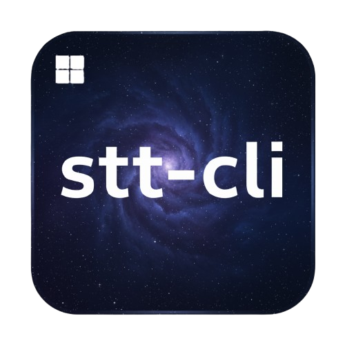

<!--  header -->
<div align="center">
  
</div>


# STT CLI

This project is a simple command-line interface (CLI) tool for Windows that provides speech-to-text functionality. It runs in the background, listens for a global hotkey, and transcribes your speech into the active command-line window.

## Purpose and Motivation

I created this tool to streamline my workflow when using command-line interfaces, especially with tools like Gemini CLI and Claude Code. It allows for hands-free typing in any CLI window, making it easier to interact with these powerful tools.  Macs already have built-in speech-to-text features, and there are apps like SuperWhisper, Voicy, and Voice Mode that work nicely with tools like Claude Code. But when I looked for something similar on Windows, I couldn’t find anything that did the job. That’s what pushed me to build this tool. I wanted Windows users who work in command-line interfaces to have an easy way to type using their voice. Hopefully, this tool fills that gap and makes voice control in the CLI much smoother.

## Features

- **Global Hotkey:** Press the **Left Alt** key twice in quick succession to start or stop recording.
- **Background Operation:** The application runs in the background without a visible window.
- **System Tray Icon:** A system tray icon indicates when the application is running and when it is actively listening.
- **CLI-Focused:** The transcribed text is typed directly into the active command-line window (e.g. Windows Terminal, PowerShell, cc).

## Requirements

- **Operating System:** Windows
- **Python:** Python 3.x (if running from source)
- **No Admin Rights** - As it does not install, simply runs in the background 

## Installation

### Using the Executable

The easiest way to use this tool is to download the pre-compiled executable (`.exe`) from the [dist folder](dist/speech-to-text-cli.exe). Simply download the file and run it.

#### System Tray Icon


### Running from Source

If you prefer to run the application from the source code, you will need to have Python 3.x installed.

1.  **Clone the repository:**
    ```bash
    git clone https://github.com/Mantej-Singh/stt-cli.git
    cd stt-cli
    ```

2.  **Install the dependencies:**
    ```bash
    pip install -r requirements.txt
    ```

3.  **Run the application:**
    ```bash
    python main.pyw
    ```

## Usage

1.  Run the application (either the `.exe` or `main.pyw`).
2.  A system tray icon will appear to indicate that the application is running.
3.  Open your preferred command-line interface (e.g., Windows Terminal).
4.  Press the **Left Alt** key twice to start recording. The tray icon will change to indicate that it is listening.
5.  Speak into your microphone. The transcribed text will be typed into the CLI window.
6.  Press the **Left Alt** key twice again to stop recording.
7.  To quit the application, right-click on the system tray icon and select "Quit".

## Building from Source

If you want to build the executable yourself, you can use `PyInstaller`:

```bash
pyinstaller --onefile --name "speech-to-text-cli" --icon "stt-cli2.ico" --noconsole --add-data "stt-cli2.ico;." --add-data "stt-cli2.png;." main.pyw
```

## Future Development

This is an initial release. Future updates will include:

-   Configurable hotkeys.
-   More visual indicators for recording status.

## Speech-to-Text Library

This project uses the `SpeechRecognition` library, which in turn uses the Google Web Speech API for transcription.

---

*Built Together with Gemini CLI*
