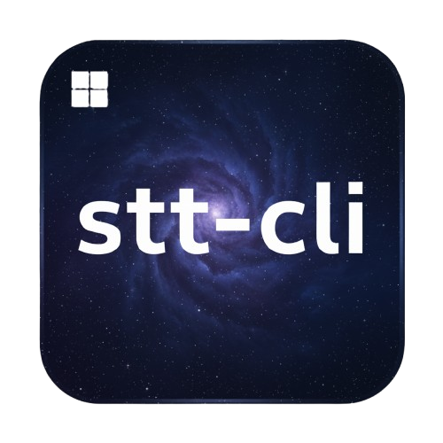
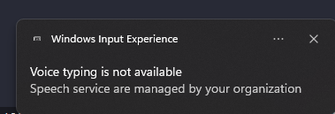
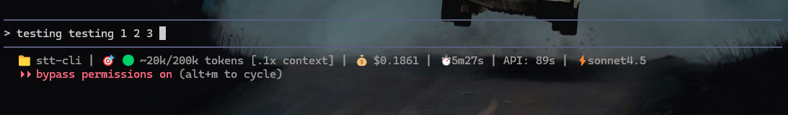
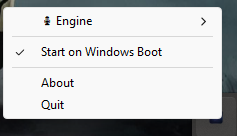

<!--  header -->
<div align="center">
  
</div>


# STT CLI

This project is a simple command-line interface (CLI) tool for Windows that provides speech-to-text functionality. It runs in the background, listens for a global hotkey, and transcribes your speech into the active command-line window.

## 🎯 Purpose and Motivation

I created this tool specifically for Windows users working on corporate laptops where Win+H is disabled by IT policies. After discovering that the built-in Windows voice typing was blocked on my work machine, I needed a solution that would:

- **Work without admin rights** - No installation or system modifications required
- **Run portably** - Just a single .exe file that runs from anywhere
- **Bypass corporate restrictions** - Doesn't touch system settings or require permissions
- **Support CLI workflows** - Specifically designed for command-line interfaces like Windows Terminal, PowerShell, and AI coding tools

I primarily use this with **Claude Code** and **Gemini CLI**, where voice input dramatically speeds up my workflow. Macs already have built-in speech-to-text features, and there are apps like SuperWhisper, Voicy, and Voice Mode that work nicely with these tools. But when I looked for a Windows alternative that worked around corporate restrictions, nothing existed. This tool fills that gap for Windows users who need voice control in the CLI but are blocked by enterprise policies.

## The Problem: Win+H Disabled on Corporate Laptops

> [!IMPORTANT]
> Many corporate and enterprise Windows laptops have the built-in voice typing feature (Win+H) disabled by IT policies and group restrictions. This is a widespread issue affecting millions of Windows users in enterprise environments.

When you try to use it, you'll see this frustrating message:

<div align="center">
  
</div>

**"Voice typing is not available - Speech service are managed by your organization"**

This leaves users without any voice-to-text capability for their command-line workflows, especially problematic when:
- You can't install software requiring admin rights
- Group policies prevent modifying system settings
- You need hands-free typing for accessibility or efficiency
- You're working with AI coding assistants like Claude Code or Gemini CLI

## The Solution: STT-CLI Running in the Background

STT-CLI solves this by running quietly in the background without requiring admin rights or system modifications. Simply double-tap Left Alt to start speaking, and your words appear directly in your terminal:

<div align="center">
  
  <p><i>Using STT-CLI with Claude Code (cc) - speaking "testing testing 1 2 3" types directly into the terminal</i></p>
</div>

The application runs as a system tray icon, works with any CLI window, and bypasses corporate restrictions since it's just a portable executable that doesn't require installation.

## Features

- **Global Hotkey:** Press the **Left Alt** key twice in quick succession to start or stop recording.
- **Background Operation:** The application runs in the background without a visible window.
- **System Tray Icon:** A system tray icon indicates when the application is running and when it is actively listening.
- **CLI-Focused:** The transcribed text is typed directly into the active command-line window (e.g. Windows Terminal, PowerShell, Claude Code).
- **Offline Speech Recognition:** Using OpenAI's Whisper "tiny" model (MIT licensed) for fully offline operation [available in v2.0+]

## Architecture

<div align="center">
  
  <p><i>System architecture overview showing hybrid speech-to-text engine and multi-threaded design. See <a href="/docs/ARCHITECTURE.md">detailed documentation</a> for technical deep dive.</i></p>
</div>

**Key Design Principles:**
- **Hybrid Engine:** Auto-switches between Google (online) and Whisper (offline) based on connectivity
- **Event-Driven:** Global hotkey triggers recording without blocking main thread
- **Security-First:** Only types into CLI windows (cmd.exe, powershell.exe, WindowsTerminal.exe)
- **Privacy-Focused:** Whisper mode keeps all audio processing local (never leaves your machine)

## Requirements

- **Operating System:** Windows 10/11
- **Python:** Python 3.x (if running from source)
- **No Admin Rights Required** - Works perfectly on corporate laptops with restricted permissions. The application doesn't install anything, doesn't modify system settings, and runs entirely in user space. Just download and run - no installation, no admin prompt, no group policy conflicts.

## Installation

### 🚀 Method 1: Windows Package Manager (Winget) - RECOMMENDED

The easiest way to install STT-CLI is through Windows Package Manager:

```bash
winget install Mantej-Singh.STT-CLI
```

**Advantages:**
- ✅ One-command installation
- ✅ Automatic updates via `winget upgrade --all`
- ✅ Trusted Microsoft repository
- ✅ Perfect for corporate IT deployment
- ✅ No manual download required

**Check for updates:**
```bash
winget upgrade Mantej-Singh.STT-CLI
```

**Uninstall:**
```bash
winget uninstall Mantej-Singh.STT-CLI
```

## 🚀 First Time Setup (After Winget Installation)

> [!IMPORTANT]
> After installing via winget, you need to start the application manually the first time. Follow these three steps to get STT-CLI running.

### Step 1: Launch the Application
```bash
# Open Windows Terminal, PowerShell, or CMD and run:
speech-to-text-cli.exe
```

The system tray icon will appear, and you'll see a welcome notification confirming the app is running.

### Step 2: Enable Auto-Start (Optional but Recommended)
To make STT-CLI start automatically when Windows boots:

1. **Right-click** the system tray icon
2. Click **"Start on Windows Boot"**
3. A checkmark (✓) will appear next to it
4. You'll see a confirmation notification

That's it! STT-CLI will now start automatically every time you log in to Windows.

### Step 3: Start Using It
1. Open any CLI window (Windows Terminal, PowerShell, CMD)
2. **Double-tap Left Alt** to start recording
3. Speak into your microphone
4. Your words appear as text in the CLI!
5. **Double-tap Left Alt** again to stop recording

**Tip:** The system tray icon changes when you're recording to give you visual feedback.

---

### Method 2: Direct Download

Alternatively, download the pre-compiled executable (`.exe`) from the [GitHub Releases](https://github.com/Mantej-Singh/stt-cli/releases/latest). Simply download the file and run it.

#### System Tray Icon


### Running from Source

If you prefer to run the application from the source code, you will need to have Python 3.x installed.

1.  **Clone the repository:**
    ```bash
    git clone https://github.com/Mantej-Singh/stt-cli.git
    cd stt-cli
    ```

2.  **Install the dependencies:**
    ```bash
    pip install -r requirements.txt
    ```

3.  **Run the application:**

    **Option A: Using the batch launcher (Windows):**
    ```bash
    # Double-click run.bat or from command line:
    run.bat
    ```

    **Option B: Direct Python command:**
    ```bash
    python main.pyw
    ```

    **Option C: Debug mode (shows console output):**
    ```bash
    run-debug.bat
    ```

## Usage

1.  Run the application (either the `.exe` or `main.pyw`).
2.  A system tray icon will appear to indicate that the application is running.
3.  Open your preferred command-line interface (e.g., Windows Terminal).
4.  Press the **Left Alt** key twice to start recording. The tray icon will change to indicate that it is listening.
5.  Speak into your microphone. The transcribed text will be typed into the CLI window.
6.  Press the **Left Alt** key twice again to stop recording.
7.  To quit the application, right-click on the system tray icon and select "Quit".

### Command-Line Options

**Note**: The executable is built as a GUI application (no console window) for clean system tray operation. Command-line flags work when running from Python source, but not in the compiled `.exe`. This is by design for Windows GUI apps.

**From Python source:**
```bash
python main.pyw --version  # Show version information
python main.pyw --help     # Show usage help
```

To check the version of the installed executable, see the GitHub release notes or the Windows Apps & Features list after Winget installation.

### Logs and Troubleshooting

If you encounter issues, check the log file located at:
```
%TEMP%\stt-cli\app.log
```

On Windows, this typically resolves to:
```
C:\Users\YourUsername\AppData\Local\Temp\stt-cli\app.log
```

The log file contains detailed information about:
- Application startup and shutdown
- Recording start/stop events
- Microphone and speech recognition errors
- CLI window detection

## Building from Source

If you want to build the executable yourself, you can use `PyInstaller`:

```bash
# First, make sure all dependencies are installed
pip install -r requirements.txt

# Then build the executable
python -m PyInstaller --onefile --name "speech-to-text-cli" --icon "stt-cli2.ico" --noconsole --add-data "stt-cli2.ico;." --add-data "stt-cli2.png;." --clean main.pyw
```

**Note**: The `--clean` flag ensures a fresh build. The resulting executable will be in the `dist` folder (approximately 77MB).

## 📝 Future Development

This is an initial release. Future updates will include:

-   Configurable hotkeys.
-   More visual indicators for recording status.

## Speech-to-Text Engines

**v2.0+:** This project supports **hybrid speech-to-text**:

### Primary Engine: OpenAI Whisper (Offline) 🎯
- **License:** MIT License (100% free for commercial use)
- **Privacy:** Audio never leaves your machine
- **Works offline:** No internet required
- **Library:** `faster-whisper` (4x faster than vanilla Whisper)
- **Model:** Tiny (39M parameters, ~70MB)

> [!NOTE]
> **Whisper Licensing:** OpenAI's Whisper model is released under the MIT License, which allows free commercial use, modification, and distribution. STT-CLI uses the `faster-whisper` implementation (also MIT licensed) for optimized performance. Audio processing happens entirely on your local machine - no data is sent to external servers.

### Fallback Engine: Google Web Speech API (Online)
- **License:** Free with usage limits
- **Requires:** Internet connection
- **Library:** `SpeechRecognition`
- **Speed:** ~0.5s latency (faster than Whisper)

**Default:** Whisper (offline-first for maximum privacy & reliability)

---

## 🚀 What's New in v2.0.0

**Hybrid Speech-to-Text with Whisper Integration** (November 26, 2025)

- 🎙️ **Offline Speech Recognition** - OpenAI Whisper "tiny" model (MIT licensed) for fully offline operation
- 🔄 **Smart Engine Switching** - Auto-detect between Google (online) and Whisper (offline) based on connectivity
- ⚡ **4x Faster Performance** - Using faster-whisper with CTranslate2 optimization and INT8 quantization
- 🔒 **Privacy-First Design** - Audio never leaves your machine in Whisper mode (100% local processing)

> [!NOTE]
> **Licensing Note:** This application uses OpenAI's Whisper model under the MIT License, which permits free commercial use, modification, and distribution. The `faster-whisper` implementation is also MIT licensed. All audio processing happens locally on your device. Learn more about Whisper [here](https://github.com/openai/whisper).

**📚 Documentation:**
- [`/docs/ARCHITECTURE.md`](docs/ARCHITECTURE.md) - System architecture overview
- [`/docs/WHISPER_MODEL.md`](docs/WHISPER_MODEL.md) - Model download, caching, and lifecycle
- [`/docs/THREADING.md`](docs/THREADING.md) - Threading model and synchronization

**Upgrade:** `winget upgrade Mantej-Singh.STT-CLI` | [Full Changelog](/docs/changelog.md)

---

*Built Together with Gemini CLI, Enhanced Further with Claude Code*
